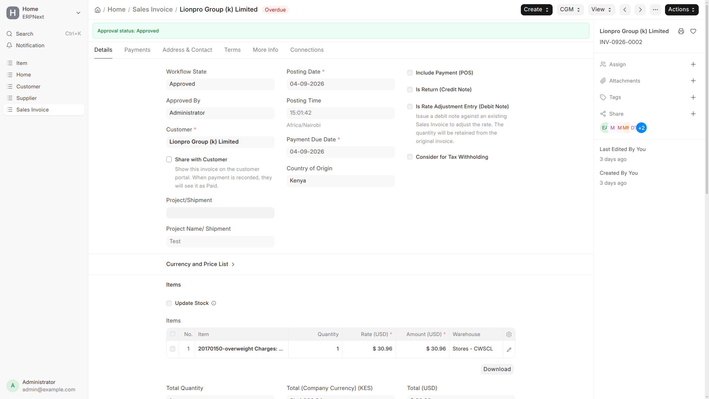

# Commercial

**Build quotations, share PDFs with clients, and bill through approved Sales Orders and Sales Invoices.**

Use this guide for sales and pricing. Finance approval steps are summarised here and detailed in [Finance](finance.md).

A typical scenario: After the Project exists, you build a quotation with valuation, tax estimates, and local charges; Finance approves; you share the Full or Local Charges PDF; then you create a Sales Invoice and wait for Accounts Manager approval before submit.

To access commercial work, go to:

> Home > Selling > Quotation

Also use:

> Home > Accounting > Sales Invoice



## 1. Prerequisites

- Project (or shipment link) from approved Opportunity
- Item pricing rules where used
- Customs Tax Type / Default Customs Tax in Settings
- Chrome PDF for print formats

## 2. Features — Quotation structure

A CGM quotation has four cost layers:

| Section | Child table / field | Currency |
|---------|---------------------|----------|
| **Import valuation** | Import Cost Component | Transaction + company (KES) |
| **Customs taxes (estimate)** | Customs Tax Component | Company currency |
| **Item pricing** | Quotation Item Pricing | Per rules |
| **Local charges** | Items (standard ERPNext lines) | Quotation currency |

Typical shipment fields: HS Code, commodity, weight, container type/qty, ports, Project link, Incoterm, shipment type.

## 3. How to — Quotation workflow

**Workflow:** `CGM Quotation Approval`

| Step | Action |
|------|--------|
| 1 | Build quotation (valuation + taxes + local charges) |
| 2 | **Submit for Finance Approval** |
| 3 | Finance approves or rejects |
| 4 | Optionally **Share with Client** (portal **My Quotations**) |
| 5 | Create **Sales Order** or **Sales Invoice** |

Only **Approved** or **Shared with Client** quotations can be billed.

## 4. Features — Print formats

| Format | Use when |
|--------|----------|
| **CGM Quotation Full** | Full breakdown (valuation + taxes + local) |
| **CGM Quotation Local Charges** | Agency fees only |
| **CGM Quotation Shipping** | Legacy combined layout |
| **CGM Sales Invoice Default** | Branded SI + QR |
| **CGM Credit Note** | Credit notes |

## 5. How to — Sales Order / Sales Invoice

**Get Items From → Quotation** copies CGM custom fields (shipment refs, IDF, ports, pricing context).

**Sales Invoice** requires:

1. Quotation in a billable workflow state
2. **CGM Sales Invoice Approval** → Finance **Approved** before submit

## 6. Features — Item pricing and customs estimates

Configure **Item Pricing Rules** on Item by shipment type, container type/size, quantity band (no overlapping rules). Quotation Item Pricing can populate from matching rules.

Default tax types (VAT, IDF, RDL, …) are seeded. Rates: **CGM Shipping Settings → Default Customs Tax**. Taxes recalculate on save from `custom_base_customs_value`.

## 7. How to — Typical commercial flow

```
Opportunity (approved) → Project created
  → Quotation linked to Project
    → Finance approves quotation
      → Share PDF with client
        → Client accepts
          → Sales Invoice
            → Finance approves SI
              → Submit and collect payment
```

## 8. Related Topics

- [Finance](finance.md)
- [CRM & Intake](crm-intake.md)
- [Customer & Transporter Portal](portals.md)
- [Operations](operations.md)
