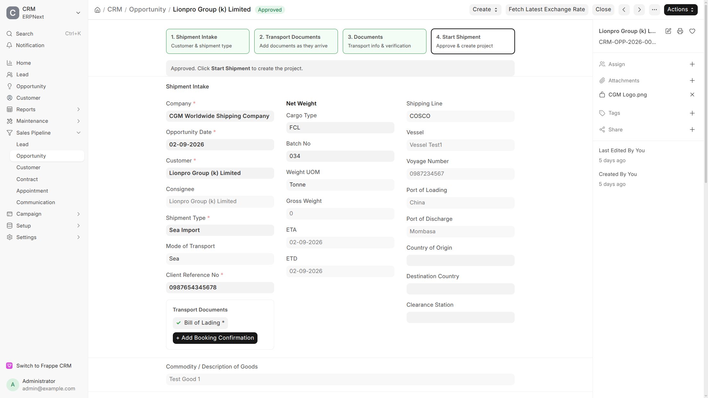
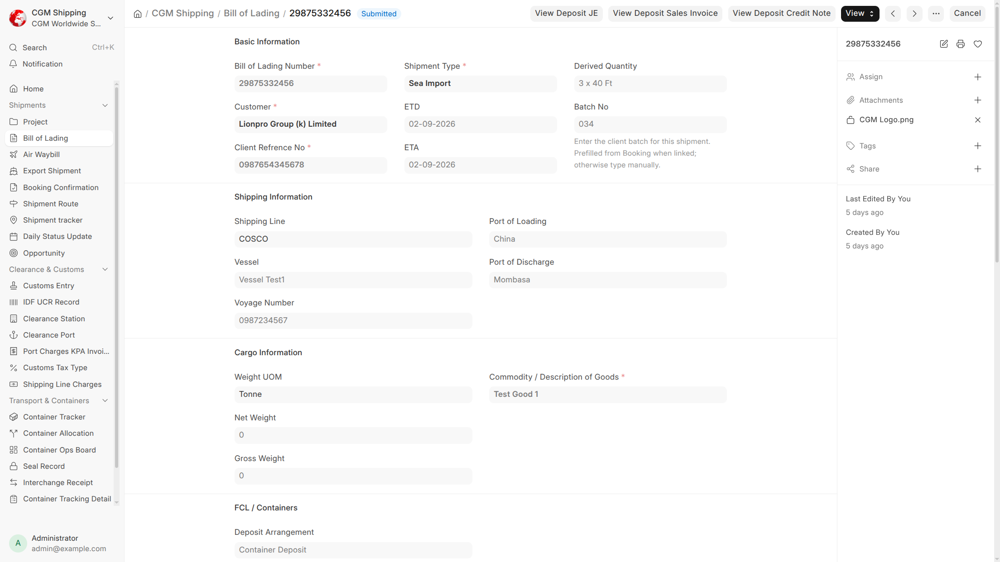

# CRM & Intake

**Qualify the deal, pick the Shipment Type, approve the Opportunity, and start the Project.**

Use this guide for sales and onboarding. The Shipment Type you choose on Opportunity selects the **CGM Task Template** and **Container Tracker Mode** for the whole clearance plan.

A typical scenario: You open an Opportunity for a sea customer, set **Shipment Type = Sea Import**, link a Bill of Lading, verify CI and PKL, get approval, and Create Project — 25 Sea Import tasks appear automatically.

To access intake, go to:

> Home > CGM Shipping > Opportunity

Also use:

> Home > CRM > Lead

> Home > CGM Shipping > Bill of Lading





## 1. Prerequisites

- Customer (or Lead to convert) and Shipment Type masters
- Document Type codes for intake (**CI**, **PKL**, …)
- Opportunity approval workflow configured on the site
- Correct transport DocType for the mode (B/L, Booking, AWB)

:::caution
**Shipment Type drives the entire task plan.** Choosing the wrong type creates the wrong template on Project. Review [Shipment Modes](shipment-modes.md) before you approve.
:::

## 2. How to — intake flow

Opportunity is the **shipment intake and authorization** record. Transport documents synchronize into it. The Project is created only after approval.

```
New Shipment
  → Create Opportunity → Select Shipment Type
    → Choose initial document (BL / Booking / AWB / None for Transit)
      → Complete document → fields sync to Opportunity
        → Upload and verify remaining client documents
          → Approve Opportunity → Start Shipment → Project + Tasks
```

| Mode family | Typical first document |
|-------------|------------------------|
| Sea import | Bill of Lading (or Booking then B/L) |
| Sea export | Booking Confirmation and/or B/L |
| Air | Air Waybill |
| Transit / road | Often None at start; use Export Shipment fields later |

Booking Confirmation = **planned** shipment. Bill of Lading = **confirmed** cargo. Adding a B/L later prefills from Booking and replaces planned vessel/ETA with confirmed values.

## 3. How to — Lead

Capture on **Lead** when useful:

| Field / section | Purpose |
|-----------------|---------|
| Shipment type / mode | Downstream workflow |
| CI / PKL attachments | Intake |
| Bill of Lading | Sea reference |
| Container information | Preview |

Preshipment containers sync from B/L when linked.

## 4. How to — Opportunity

### Required for Project creation

| Requirement | Detail |
|-------------|--------|
| `workflow_state` | Must be **Approved** |
| `party_name` | Must be a **Customer** (not Lead) |
| One Project | Only one Project per Opportunity |

### Key sections

- **Client documents** (`custom_clients_documents`)
- Transport refs: B/L, AWB, containers, vessel, clearance station
- Consignee, batch, CGM ref fields
- **Shipment Type** → template + tracker mode ([Shipment Modes](shipment-modes.md))

Verified documents are stamped when Opportunity reaches approved state.

## 5. How to — Create Project

From an approved Opportunity:

1. Use **Create Project** / Start Shipment.
2. Project receives `custom_source_opportunity`, `custom_cgm_ref_no`, `custom_shipment_status` = Draft, and carried documents.
3. Tasks are created from the Shipment Type’s **CGM Task Template** (25 for Sea Import, other counts for other modes).

## 6. Features — Intake document guard

Before Project can move to **Documents Received**:

- **CI** (Commercial Invoice) — verified
- **PKL** (Packing List) — verified

(`INTAKE_DOCUMENT_CODES`)

## 7. Features — Bill of Lading

- Unique `bl_number`
- FCL: container rows (from Booking size×qty when applicable)
- LCL: packages; no container table
- Links: `linked_opportunity`, optional `booking_confirmation`
- On submit: syncs into Opportunity (and Project if present)
- Feeds **Container Tracker** on Project

Customer **KRA PIN** attachment on Customer syncs to document type `KRA_PIN`.

## 8. Related Topics

- [Shipment Modes](shipment-modes.md)
- [Getting Started](process-overview.md)
- [Operations](operations.md)
- [Commercial](commercial.md)
- [Customer & Transporter Portal](portals.md)
