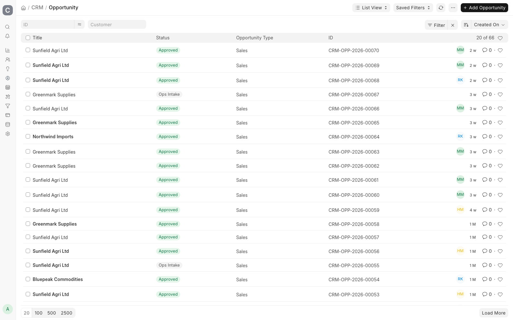

# CRM & Intake Guide

For **sales** and **customer onboarding**: Lead → Opportunity → Project.

---

## Where to work

| Item | Path in Desk |
|------|----------------|
| New enquiry | **Lead** |
| Qualified deal | **Opportunity** |
| Live shipment | **Project** |
| Transport docs | **Bill of Lading**, **Air Waybill** |

Every deal in the pipeline, with the intake stage each one has reached:



**Status** is the intake stage, not the sales stage. **Ops Intake** means documents are still
being gathered; **Approved** means the Opportunity has cleared the gate and a Project can be
started from it.

---

## The intake flow

Opportunity is the **shipment intake & authorization record** (single source of truth).
Transport documents (Booking Confirmation, Bill of Lading, Air Waybill) synchronize into it.
The Project is created only after approval.

```
New Shipment
  → Create Opportunity → Select Shipment Type
    → Choose initial document (BL / Booking / AWB / None for Transit)
      → Complete document → fields sync to Opportunity
        → Upload & verify remaining client documents
          → Approve Opportunity → Start Shipment → Project + Tasks
```

Booking Confirmation = **planned** shipment. Bill of Lading = **confirmed** cargo.
Either may arrive first; both workflows are supported. Adding a BL later (from Opportunity
or Project) prefills from the Booking and replaces planned vessel/ETA/etc. with confirmed values.

---

## Two ways a shipment starts

| | Existing customer | New customer |
|---|---|---|
| Start from | Transport document (**Bill of Lading** / **Air Waybill** / **Booking Confirmation**) | Create the **Customer** first |
| Then | Create the Opportunity from it | Then follow the same path as an existing customer |

The transport document comes first because it is what the customer actually sends. Capturing it creates the shipment record that the Opportunity is then built on, so the B/L number, containers and goods description never get typed twice.

**A Customer must already exist before a shipment can be raised.** There is no path that creates one part-way through intake - if this is a new client, the Documentation team creates the Customer, then starts the shipment.

---

## Approval before a shipment exists

Intake is a **workflow on Opportunity** (`CGM Opportunity Pre-Shipment`). No Project is created until it has been approved.

| State | What it means | Who moves it on |
|-------|---------------|-----------------|
| **Ops Intake** | Documentation is still assembling documents | Anyone: **Send For Review** |
| **Pending Approval** | With the Operations Manager | **Approve** - Operations Manager only |
| | | **Return for Amendment** - back for correction, stays in Pending Approval |
| | | **Reject** - closed as Rejected |
| **Approved** | Shipment authorised. The Project can be started | **Cancel** if it falls away |

Only the **Operations Manager** can approve. Everything else can be done by anyone with access, so a shipment cannot slip into operations without that sign-off.

What the Operations Manager is checking: the attached documents are the right ones and legible, the shipment details match them, and nothing required is missing. A return for amendment goes back to Documentation to fix and resubmit.

---

## Lead

**Lead is stock ERPNext** - name, company, contact details, source. It carries no CGM shipment fields.

Shipment intake starts at **Opportunity**, not here: the shipment type, transport document, cargo and client documents are all captured there. A Lead is only the enquiry that comes before it.

Qualify the Lead in the normal way, then use **Create > Opportunity** to carry the contact across and begin intake.

---

## Opportunity

### Required for Project creation

| Requirement | Detail |
|-------------|--------|
| `workflow_state` | Must be **Approved** |
| `party_name` | Must be a **Customer** (not Lead) |
| One Project | Only one Project per Opportunity |

### Key sections

- **Client documents** (`custom_clients_documents`) - Shipment Document child table
- Transport references: B/L, AWB, container type/qty, vessel, clearance station
- Consignee, batch, CGM ref fields

The Opportunity form carries all of it. The four-step wizard across the top is the intake
stage, and the banner under it names the next action:


**1** The stage pill and the four steps across the top are the intake state. All four complete
means the banner reads *Approved. Click **Start Shipment** to create the project.* Before
approval the same banner names whatever is still missing, so you do not have to know the gate
rules to see what is blocking you.

**2** **Shipment Type** chooses the task plan the Project is built from - change it here, not
after the Project exists.

The **Transport Documents** panel on the left shows which documents are attached - here a
Bill of Lading, with Booking Confirmation still available to add. Fields greyed out on the
right (vessel, voyage, ports) are synced from that transport document, not typed here.

### On approval

Verified documents are stamped when Opportunity reaches approved state (hooks on save/submit).

---

## Creating the Project

From an approved Opportunity:

1. Use the **Create Project** action (or equivalent dashboard link).
2. Project receives:
   - `custom_source_opportunity`
   - `custom_cgm_ref_no` (LP naming: `{qty}X{size}-{batch}/{seq}`)
   - `custom_shipment_status` = Draft
   - Shipment documents carried from Opportunity
3. If Shipment Type uses sea-import workflow → **25 clearance tasks** are created automatically.

---

## Intake document guard

Before Project can move to **Documents Received**, the documents set in
**CGM Shipping Settings > Shipment status documents** must be attached on Project
shipment documents. By default that is the row *Documents Received -> Client documents*
with **Must Be Verified** off, which covers:

- **CI** (Commercial Invoice)
- **PKL** (Packing List)

A Document Type counts when **Default Required** is ticked, its **Required Stage** matches
the row, and it applies to the shipment's mode of transport. Add rows for other statuses,
change the stage, or tick Must Be Verified to also require verification.

The same table decides the documents needed to mark a Project **Completed** (its *Completed* rows):
by default CI, PKL, KRA_PIN, plus BL for Sea and AWB for Air, attached but not necessarily verified.

---

## Bill of Lading

- Unique `bl_number`
- Container child table (FCL): when created from a Booking, rows are auto-generated from
  requested size×qty - user only enters container number and seal
- LCL: packages/package type prefilled; no container table
- Links: `linked_opportunity`, optional `booking_confirmation`
- On submit: syncs shipping/cargo/containers into Opportunity (and Project if already created)
- Container rows feed **Container Tracker** on Project

---

## Customer master

On **Customer**, attach **KRA PIN** file → syncs to document type `KRA_PIN` for clearance.

---

## Opportunity dashboard

Opportunity form shows linked B/L, AWB, containers, and preshipment status (custom dashboard in `shipment.py`).

---

## Related guides

- [Operations](operations.md)
- [Commercial](commercial.md)
