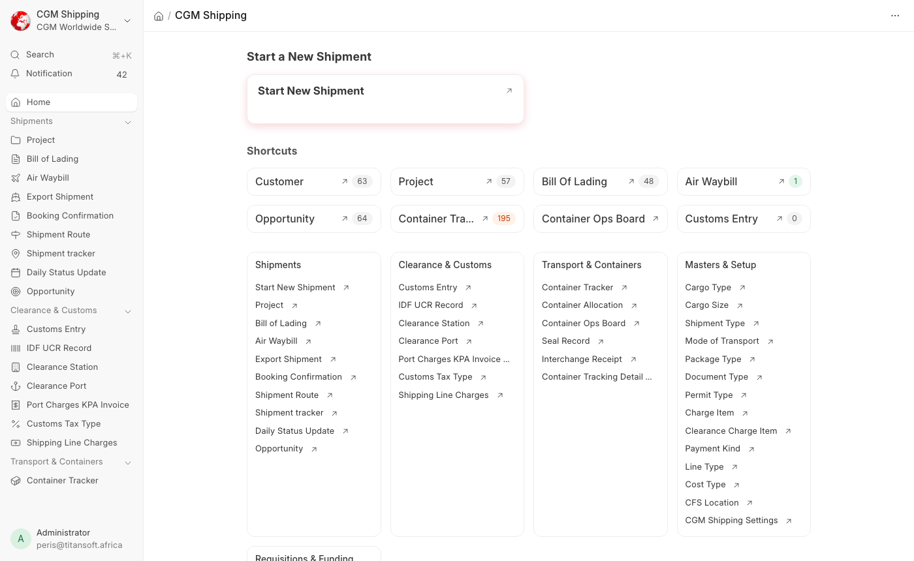

# What CGM Adds to ERPNext

For **developers**, **system admins**, and anyone who needs to know whether a field, form or rule is stock ERPNext or something CGM added.

Everything here belongs to the `cgm_shipping` app in the **CGM Worldwide Shipping** module. Nothing else on the site should be assumed customised.

---

## At a glance

| What | Count |
|------|-------|
| Custom DocTypes | **85** - 44 standalone, 38 child tables, 3 single |
| Custom fields added to stock DocTypes | **189** across 23 DocTypes |
| Property Setters | 18 |
| Workflows | 6 |
| Notifications | 41 |
| Reports | 11 |
| Print formats | 7 |
| Web forms | 1 |
| Client Scripts / Server Scripts | **0** - all behaviour is in app code, not the database |

That last row matters: there are no desk-authored scripts to hunt through. Every behaviour is in the app, under version control.

---

The **CGM Shipping** workspace is the whole custom surface in one place - the shipment, clearance, container and master DocTypes, with live counts:

---

## Custom DocTypes

Grouped by what they are for. Row counts are from this site, and show what is genuinely in use versus built but not yet adopted.

### Shipment and transport documents

| DocType | Rows | Notes |
|---------|------|-------|
| **Bill of Lading** | 48 | Submittable. The sea shipment record |
| **Booking Confirmation** | 15 | Submittable |
| **Air Waybill** | 1 | Submittable |
| **Export Shipment** | 0 | Submittable, not yet used |
| **Shipment Update** | 57 | The portal conversation - see [Portals](portals.md#messages) |
| **Shipment Route**, **Shipment tracker** | 0 | Defined, not yet used |

### Containers

| DocType | Rows | Notes |
|---------|------|-------|
| **Container Tracker** | 195 | One per container, per shipment |
| **Seal Record** | 220 | Seal numbers against containers |
| **Container Allocation** | 3 | Submittable. The transporter's job |
| **Interchange Receipt** | 0 | Submittable. Proof of empty return |

### Customs and clearance

| DocType | Rows | Notes |
|---------|------|-------|
| **IDF UCR Record** | 56 | Submittable |
| **Permit Register** | 447 | Per-shipment permits. Not the company licence register |
| **Customs Entry** | 0 | Submittable, not yet used |
| **Port Charges KPA Invoice** | 0 | Submittable, not yet used |

### Licences and compliance

| DocType | Rows | Notes |
|---------|------|-------|
| **License Register** | 3 | The company's own licences - see [Licences](licences.md) |
| **License Type**, **Licensing Contact** | 3, 2 | |
| **License Reminder Log** | 1 | What was sent, and when |
| **License Settings** | single | Schedule and recipients |

### Finance

| DocType | Rows | Notes |
|---------|------|-------|
| **Funding Request** | 0 | Submittable. Has its own approval workflow |
| **Shipping Line Charges** | 0 | Submittable |
| **Charge Item**, **Clearance Charge Item** | 3, 9 | Charge masters |
| **Payment Kind**, **Cost Type** | 6, 0 | |

### Masters

**Shipment Type** (9), **Document Type** (29), **Clearance Station** (27), **CFS Location** (21), **Permit Type** (7), **Customs Tax Type** (7), **Warehouse Station** (6), **Container Tracker Mode** (5), **CGM Role Group** (5), **Cargo Type** (3), **Customs Calculation Mode** (3), **Mode of Transport** (3), **Line Type** (3), **Cargo Size** (2), **Package Type** (2), **Clearance Port** (1), **Material Request Purpose** (0).

### Engine and settings

| DocType | Notes |
|---------|-------|
| **CGM Shipping Settings** | Single. Task gates, package visibility, notification routing, clearance charge defaults |
| **CGM Task Template** (8) | The task plans - one per shipment type. See [Operations](operations.md#where-the-tasks-come-from) |
| **Portal Feedback** (8) | Ratings from both portals |
| **Additional Salary Tool** | Single. Payroll helper |

---

## Fields added to stock DocTypes

189 custom fields, concentrated in a few places:

| DocType | Fields | What they add |
|---------|--------|---------------|
| **Project** | 60 | The whole shipment record: status, references, transport details, documents, containers, cost totals |
| **Task** | 42 | Task flow keys and sequence, documents, permits, finance lines, container updates |
| **Opportunity** | 22 | Shipment intake: type, transport document, cargo, client documents |
| **Quotation** | 11 | Import cost components, customs taxes, item pricing, shipment references |
| **Sales Invoice** | 8 | Approval fields, customer share |
| **Material Request** | 8 | Funding link and approved amounts |
| **Journal Entry** | 7 | Finance cost ledger links |
| **Employee Advance** | 5 | Material request, funding request, project, per diem |
| **Purchase Invoice**, **Supplier**, **Container**, **Leave Application** | 3 each | Transporter share, shipping line rates, leave attachments |
| **Employee Grade**, **Expense Claim Detail** | 2 each | Job group per diem - see [Per Diems](per-diems.md) |
| **Employee**, **Customer**, **Territory**, **Leave Type**, **Job Applicant**, **Salary Component**, **Purchase Order**, **Bill of Lading**, **Permit Register** | 1 each | |

**Lead has none.** It was customised once and deliberately stripped back to stock - see [CRM & Intake](crm-intake.md#lead).

Where they live: `cgm_shipping/cgm_worldwide_shipping/custom/<doctype>.json`, applied on every migrate.

---

## Workflows

| Workflow | On | States |
|----------|-----|--------|
| **CGM Sea Import Workflow** | Project | 18, Draft to Completed - see [Operations](operations.md#project-workflow-shipment-status) |
| **CGM Opportunity Pre-Shipment** | Opportunity | Ops Intake, Pending Approval, Approved, Rejected, Cancelled - see [CRM & Intake](crm-intake.md) |
| **CGM Sales Invoice Approval** | Sales Invoice | Draft, Pending Approval, Approved, Cancelled |
| **CGM Funding Request Approval** | Funding Request | Draft, Pending, Approved, Partially Approved, Disbursement in Progress, Disbursed, Completed, Rejected, Cancelled |
| **CGM Material Request Funding** | Material Request | Draft, Submitted, Unfunded, On Funding Request, Pending, Approved, Partially Approved, Disbursed, Rejected, Cancelled |
| **Leave Application Workflow** | Leave Application | Five approval stages - see [Leave](leave.md) |

---

## Notifications

41 in total. The workflow ones are **routed through CGM Shipping Settings**: code fires a stable event, Settings maps that event to whichever Notification should send. Edit wording and recipients in the Desk freely - migrate only seeds defaults that are missing, and never overwrites your edits.

- **Finance round trips** - invoice to Finance, receipt to attach, receipt to verify, for UCR, Entry, Shipping Line, Permits and KPA. See [Finance](finance.md)
- **Your Turn** - one per department. See [Operations](operations.md#being-told-it-is-your-turn)
- **Licence expiry** - see [Licences](licences.md)
- **Container deposit refund reminders**, **daily status RAG alerts**, **final document review**

---

## Reports

| Report | Area |
|--------|------|
| Container Tracking Report, Container Tracking Detail, Container Return Tracker | Containers |
| Funding Request Report, Material Request Funding, Project Expense Summary | Finance |
| Payroll Registers, DTB Salary Payment Schedule | Payroll |
| NSSF Monthly Return, PAYE Monthly Return, SHIF Monthly Return | Kenyan statutory returns |

---

## Print formats and web forms

**Print formats:** CGM Sales Invoice, CGM Sales Invoice Default, CGM Credit Note, CGM Quotation Full, CGM Quotation Shipping, CGM Quotation Local Charges, CGM Purchase Invoice Transporter.

**Web form:** `cgm-job-application`, the public careers form.

---

## Where to look in the repo

| Kind | Path |
|------|------|
| Custom DocTypes | `cgm_shipping/cgm_worldwide_shipping/doctype/` |
| Fields on stock DocTypes | `cgm_shipping/cgm_worldwide_shipping/custom/*.json` |
| Behaviour | `cgm_shipping/cgm_worldwide_shipping/customizations/*.py` |
| Hooks (doc events, scheduler, assets) | `cgm_shipping/hooks.py` |
| Migrate-time installers | `cgm_shipping/install.py` |
| Patches | `cgm_shipping/patches/` and `patches.txt` |
| Reports | `cgm_shipping/cgm_worldwide_shipping/report/` |
| Portal pages | `cgm_shipping/www/` |

---

## Related guides

- [Operations](operations.md) - the shipment flow these customisations serve
- [Full feature documentation](../full-documentation.md) - the narrative version
