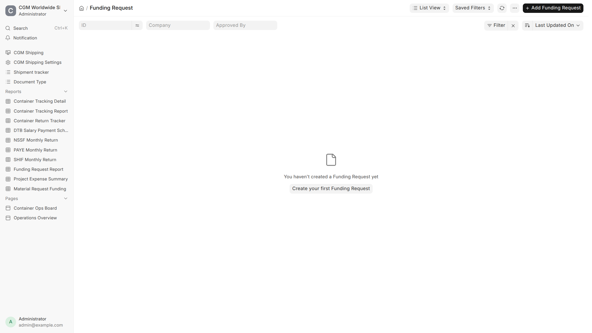

# Funding Request

**Batch Material Requests for approval and payment — operational expense by Journal Entry, purchase by Purchase Order after funding is approved.**

Use this guide when you need cash or a purchase that is **not** a clearance task payment (UCR, shipping line, entry slip, KPA, permits on Tasks). Employee Advance is **not** used for this path.

A typical scenario: An officer raises an Operational Expense Material Request for field disbursements against a Project. Finance pulls open requests onto a Funding Request, an approver sets approved amounts, and Finance posts a Journal Entry to the Default Operational Expense Account.

To access Funding Request, go to:

> Home > CGM Shipping > Funding Request

Also use:

> Home > Stock > Material Request

> Home > Accounting > Journal Entry

> Home > Buying > Purchase Order



## 1. Prerequisites

- **Material Request Purpose** masters as used on site
- User linked to an **Employee** (required for Operational Expense)
- Role to create Material Requests; **Funding Approver** (or site workflow roles) for approval
- **CGM Shipping Settings → Default Operational Expense Account** set for JE posting
- Optional: Project on the Material Request for cost tracking

:::note
Clearance invoices on shipment Tasks use [Finance](finance.md) task payments — not Funding Request.
:::

## 2. How to — choose request type

| Material Request type | After funding approval | Payment / buy path |
|----------------------|------------------------|--------------------|
| **Operational Expense** | Amounts approved on Funding Request | **Journal Entry** (expense + bank/cash). No warehouse / stock indent. |
| **Purchase** | Funding must be approved | **Purchase Order** (then PI / Payment Entry as usual) |
| **Subcontracting** | Funding must be approved | **Purchase Order** (same funding gate as Purchase) |

### Operational Expense rules

- Set **Employee** (who receives the cash). Link your User on the Employee record if the field should fill automatically.
- Warehouses are cleared — this is not a stock indent.
- Project can sit on the header (`custom_project`) and copies to item Project dimensions.

### Purchase / Subcontracting rules

- You **cannot** create a Purchase Order (or related RFQ / supplier quotation helpers CGM overrides) until the linked Funding Request is **approved**.
- Shipping Line suppliers cannot be used on these Purchase Orders.

## 3. How to — create and approve funding

```
Material Request (Submit)
  → Funding Request (pull / Get Material Requests)
    → Approver sets Approved / Rejected amounts per line
      → Operational Expense → Create Journal Entry
      → Purchase / Subcontracting → Create Purchase Order (only after approved)
```

1. Create and **Submit** each Material Request with the correct type, items, amounts, and Project where relevant.
2. Open **Funding Request** (`FR-.YYYY.-…`) → add submitted Material Requests that are waiting for funding.
3. Submit the Funding Request into the site’s approval workflow (Pending Approval → Approved / Rejected, etc.).
4. Approvers set **approved** (or rejected) amounts per request line — not only a header yes/no.
5. After approval:
   - **Operational Expense:** create Journal Entries from the Funding Request (uses Default Operational Expense Account when configured).
   - **Purchase / Subcontracting:** create Purchase Orders for remaining funded rows.

:::tip
Use **Funding Request Report** and **Material Request Funding** reports to see what is unfunded, on a request, or disbursed.
:::

## 4. Features — guards and settings

| Guard / setting | Effect |
|-----------------|--------|
| Operational Expense without Employee | Save/submit blocked until Employee is set |
| PO before funding approved | Blocked for Purchase / Subcontracting |
| Default Operational Expense Account | JE lines for ops expense; set in **CGM Shipping Settings** |
| Project on MR | Carried into JE / buying documents for shipment costing |
| Shipping Line supplier on PO | Blocked |

Workflow states on Material Request and Funding Request are site-configured ERPNext Workflows; CGM maps pending / approved / disbursed behaviour in code so Desk and reports stay consistent.

## 5. Features — vs clearance task payments

| | Task payments | Funding Request |
|--|---------------|-----------------|
| **Trigger** | Application / permit task on a shipment | Material Request |
| **Examples** | UCR, Permit, Shipping Line, ENTRY_SLIP, KPA | Petty cash, tools, subcontract services |
| **Objects** | Task finance lines → JE / Payment Entry | Funding Request → JE or PO |
| **Guide** | [Finance](finance.md) | This page |

## 6. Related Topics

- [Finance](finance.md) — two finance paths overview
- **CGM Shipping Settings** — Default Operational Expense Account
- [Operations](operations.md)
- [Getting Started](process-overview.md)
