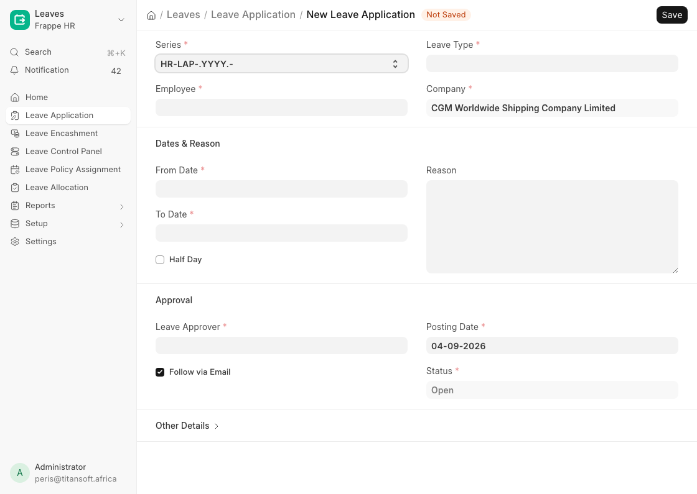
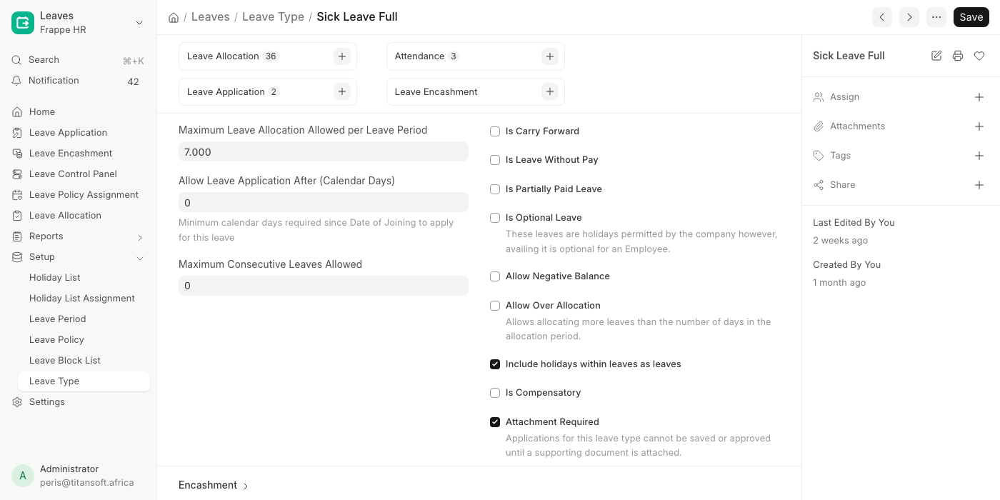

# Applying for Leave

For **all employees**. Covers checking your balance, applying, and what happens after you submit.

---

## Before you apply

Check your balance first - an application for more days than you hold will be rejected by the system, not by your approver.

| Where | What it shows |
|-------|---------------|
| **Leave Application** form | Balance for the selected leave type, once you pick the type and dates |
| **Employee Leave Balance Summary** report | All your leave types on one screen |
| **Leave Ledger Entry** | Every credit and deduction, if a figure looks wrong |

---

## Leave types

| Leave type | Days | Document | Notes |
|------------|------|----------|-------|
| **Annual Leave** | 21 per year | - | Earned monthly - see below |
| **Sick Leave Full** | 7 | **Required** | Full pay |
| **Sick Leave Half** | 7 | **Required** | Half pay - used after Sick Leave Full is exhausted |
| **Compassionate Leave** | 7 | - | Bereavement and family emergencies |
| **Maternity Leave** | 90 | **Required** | Female employees |
| **Paternity Leave** | 14 | **Required** | Male employees |
| **Compensatory Off** | Earned | - | Requires an approved **Compensatory Leave Request** first |
| **Study Leave** | - | **Required** | **Unpaid.** Deducted from salary |
| **Unpaid Leave** | - | - | **Unpaid.** Deducted from salary |

Study Leave and Unpaid Leave are Leave Without Pay. Days taken reduce that month's pay.

### How Annual Leave builds up

Annual Leave is **earned**, not granted upfront. You accrue **1.75 days each month**, credited on the **last day of the month**.

- A day booked before it has been earned will not have balance behind it - check the figure on the form, not the 21.
- Unused days **carry forward** into the next leave period, up to **35 days**.
- Your opening balance as at the start of the current period was loaded from the 2025 leave records.

---

## How to apply

1. Open **Leave Application** → **Add Leave Application**  
   (Desk: `/app/leave-application/new`)
2. **Leave Type** - pick from the list above.
3. **From Date** and **To Date**.  
   Weekends and public holidays on the **Kenya Holiday List** are excluded automatically - you do not need to subtract them yourself.
4. **Half Day** - tick if you are taking part of a day, then set the **Half Day Date**.
5. **Supporting Document** - appears only for leave types that require one (see below). Upload the file here.
6. **Leave Approver** - **required**. Usually filled in from your Employee record; set it if blank.
7. **Reason** - state it briefly. Your approver sees this and nothing else.
8. **Save**.

The application starts at **Pending Line Manager Approval**.

### Supporting documents

**Five leave types cannot be filed without a document.** The system enforces this - it is not left to your approver's discretion:

- **Sick Leave Full** and **Sick Leave Half** - a medical note
- **Maternity Leave** and **Paternity Leave** - the supporting paperwork
- **Study Leave** - proof of the course or exam

A **Supporting Document** field appears on the form as soon as you choose one of these leave types, marked as required. Upload the file there and save as normal - there is no separate step. The field stays hidden for leave types that do not need one.

If you try to save without it, the application is refused:

> Sick Leave Full requires a supporting document. Attach one in **Supporting Document** before saving.

For all other leave types you can still attach files from the sidebar where the reason calls for it - for example documentation supporting compassionate leave.

HR controls which types this applies to, with **Attachment Required** on the Leave Type:

---

## What happens next

How many approvals your leave needs depends on two things on your Employee record: your **branch**, and whether your **department sits under Operations**. Both are shown on the application.

Departments under Operations are Declaration, Documentation, Field Operations, Transport, Tracking and Operations Management. Finance, HR & Admin, ICT, Marketing, Quality Assurance and Admin are not.

| Who | Approval chain |
|-----|----------------|
| **Mombasa**, department under Operations | Line manager → Senior Supervisor → Operations Manager → HR → Director |
| **Mombasa**, department under Operations, *reporting straight to the Operations Manager* | Line manager → Operations Manager → HR → Director |
| **Nairobi**, department under Operations | Line manager → Operations Manager → HR → Director |
| **Everyone else** - any other branch, or any department outside Operations | Line manager → HR → Director |

Each approval must clear before the next begins. Every chain ends with a **Director**, whose approval is what posts the days to your balance.

| Status | Meaning |
|--------|---------|
| **Pending Line Manager Approval** | With your leave approver, as named on your Employee record |
| **Pending Senior Supervisor Approval** | Mombasa Operations staff who report into the supervisor line |
| **Pending Operations Manager Approval** | Mombasa and Nairobi Operations staff |
| **Pending HR Approval** | HR, before the Director |
| **Pending Director Approval** | The final approval |
| **Approved** | Submitted and posted to your leave balance |
| **Rejected** | Declined at any stage. See **Reason for Rejection** on the form |
| **Cancelled** | Withdrawn after approval - HR Manager only |

While the application sits at stage 1 you can still edit or cancel it. Once your line manager has approved, it is out of your hands.

**You cannot set the Status field yourself.** It is read-only and moves only through the **Approve** / **Reject** buttons, used by whoever holds the current stage. This keeps the record honest about who decided what.

**Any** approver in your chain can reject, and rejection ends the application there - it does not fall back to the previous stage. The rejecting approver must give a reason, and it appears on the form in **Reason for Rejection**. If a rejection is unclear, that field is the first place to look.

Stage 1 belongs to your line manager alone - the approver named on your Employee record. Nobody else can stand in for it. If your line manager is away, ask HR to point your Employee record at a stand-in approver.

### Emails

Each hand-off sends one email, to the person whose turn it is:

| When | Who gets it |
|------|-------------|
| You submit the application | Your line manager |
| Line manager approves | The next approver in your branch's chain |
| Each further approval | The approver after them |
| HR approves | Directors |
| A Director approves, or anyone rejects | You |

> **Note:** the emails are sent by six **Notification** records named `CGM Leave - …`. HR can edit their wording, recipients or switch them off in **Notification** (Desk: `/app/notification`) without touching the workflow.

---

## Changing or withdrawing an application

| Situation | What to do |
|-----------|------------|
| Still **Pending Line Manager Approval** | Cancel it and submit a corrected one |
| Already past stage 1 | Ask whoever holds it now to reject it, then submit a corrected one |
| Already **Approved**, plans changed | Ask HR to cancel it - HR Manager only. The days return to your balance |
| **Rejected**, want to re-apply | Submit a new application. Address the rejection reason |

---

## Common problems

**"Leave approver is mandatory"** - the Leave Approver field is blank. Fill it in; if you do not know who it should be, ask HR to set it on your Employee record.

**Insufficient balance** - you are applying for more days than you currently hold. For Annual Leave, remember days accrue monthly, so your balance today is lower than your full-year entitlement.

**Overlapping application** - you already have an application covering one of these dates. Find it and cancel it before submitting a new one.

**"Requires a supporting document"** - you are applying for sick leave without a medical note. Upload it in the **Supporting Document** field on the form.

**Applied-for days look wrong** - the count excludes weekends and Kenya Holiday List holidays. If it still looks wrong, check whether Half Day is ticked.

---

## Related guides

- [Finance](finance.md)
