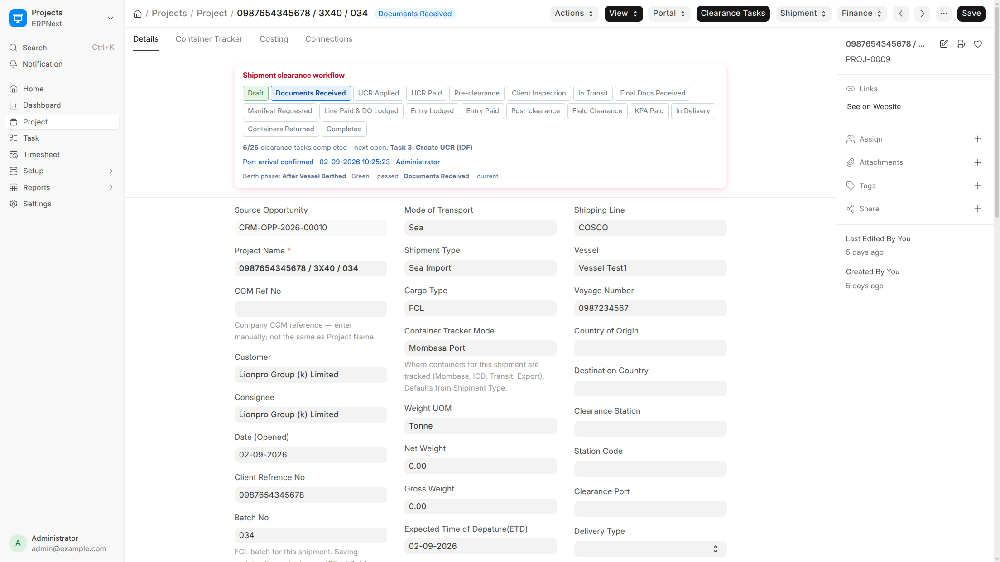
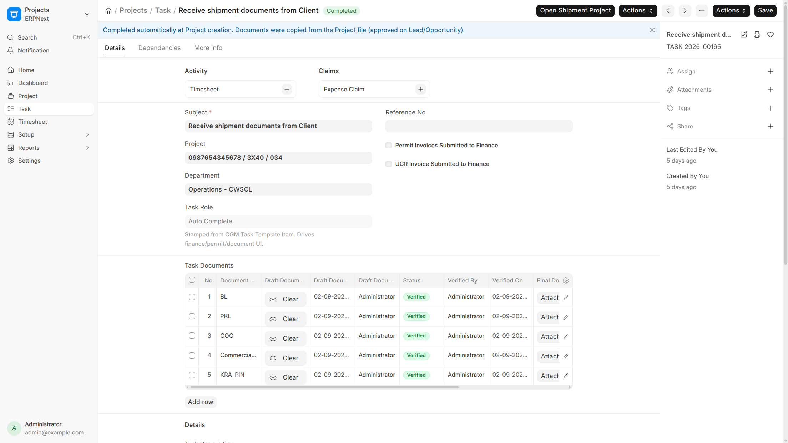

# Operations

**Projects, clearance tasks, documents, and live container dashboards for Operations, Documentation, and Field teams.**

Use this guide for Sea Import day-to-day work on Desk. Other Shipment Types use different task sequences — same Project/Task skills, different plan.

A typical scenario: After CRM creates a Sea Import Project, you verify CI and PKL, advance to Documents Received, complete auto intake tasks, hand UCR to Declaration, then chase manifests, DO, field clearance, and KPA before Transport takes delivery.

To open Operations work, go to:

> Home > CGM Shipping > Project

Also use:

> Home > CGM Shipping > Task

> Home > CGM Shipping > Container Ops Board

> Home > CGM Shipping > Operations Overview





## 1. Prerequisites

- Department roles matching the task template (Operations, Documentation, Field Operations, …)
- Project created from an **Approved** Opportunity
- Document Type masters (CI, PKL, MANIFEST, DO, …)
- Understanding of your Shipment Type’s task plan

:::tip
Sea Import (25 tasks) is detailed below. For Sea Export, Air, Transit, and Road plans, see [Shipment Modes](shipment-modes.md).
:::

## 2. How to — Sea Import ops tasks

| Seq | Task | Your team |
|----:|------|-----------|
| 1 | Receive shipment documents from Client | Operations |
| 2 | Share documents with Declarants | Operations |
| 7 | Client conducts inspection | Operations |
| 8 | Receive Final Clearance Documents | Documentation |
| 9 | Request Manifest and Local Import Charges | Documentation |
| 10 | Attach Shipping Line Invoice | Documentation |
| 14 | Lodge Delivery Order | Operations |
| 17 | Field Officers conduct clearance | Field Operations |
| 18 | Supervisor obtains KPA Invoice | Operations |

Tasks **1–2** auto-complete when intake documents are verified on the Project.

:::note
Steps **4, 6, 11, 13, 16, 19** are Finance. You attach invoices; Finance pays. See [Finance](finance.md).
:::

:::note
UCR, permits, and Create Entry are Declaration. See [Declaration & Customs](declaration-customs.md).
:::

:::note
Steps **20–25** are Transport. See [Transport & Containers](transport-containers.md).
:::

## 3. Features — Project workflow (shipment status)

**`custom_shipment_status`** tracks Sea Import clearance (`CGM Sea Import Workflow`):

```
Draft
  → Documents Received
  → UCR Applied → UCR Paid
  → Pre-clearance
  → Client Inspection
  → In Transit
  → Final Docs Received
  → Manifest Requested
  → Entry Lodged → Entry Paid
  → Line Paid & DO Lodged
  → Post-clearance
  → Field Clearance
  → KPA Paid
  → In Delivery
  → Containers Returned
  → Completed
```

### What blocks advancing status

| Rule | Meaning |
|------|---------|
| **Task gates** | Cannot skip ahead of incomplete tasks (CGM Shipping Settings) |
| **Document gates** | Required documents must be **Verified** before some state changes |
| **Intake documents** | **CI** and **PKL** required before **Documents Received** |
| **Closure** | All 25 sea tasks must be complete before **Completed** |

## 4. How to — Documents on Project

Open the Project → **Shipment Documents** child table.

| Action | When |
|--------|------|
| Upload initial version | Client sends draft document |
| Upload final version | Corrected / stamped version received |
| Verify / Reject | Supervisor confirms document is acceptable |

Final attachment review can move Draft → Pending Review → Approved / Rejected. Document types live in **Document Type**.

## 5. Features — Container Ops Board

**Route:** `/app/container-ops-board` (workspace: Container Ops Board)


- Overdue empty returns and demurrage risk
- Filters: client, project, B/L, batch, clearance station
- Lifecycle statuses and **Empty Return Tracker** tab

## 6. Features — Operations Overview

**Route:** `/app/operations-overview` (workspace link: Operations Overview)

Management page for filtered shipment KPIs and grids (date range, shipping line, customer, project, status, cargo size, currency). Roles typically include Operations Manager, Finance Manager, and System Manager.

Use it for cross-shipment visibility; use **Container Ops Board** for container-level execution.

## 7. How to — Daily Status Update

1. From Project Actions or **Daily Status Update** list, create `DSU-{date}-{#####}`.
2. Capture RAG / narrative for active shipments.
3. Submit — Finance and management receive notifications when **Daily Status RAG Alert** is configured.

## 8. How to — Common Sea Import workflow

### New shipment (after CRM)

1. Confirm Project exists from approved Opportunity.
2. Verify **CI** and **PKL** on Project documents.
3. Advance status to **Documents Received** when intake is complete.
4. Complete tasks 1–2 (often automatic).
5. Hand off to Declaration for UCR (task 3).

### After vessel arrival

1. Confirm ATA on Project (Actions → Confirm Shipment Arrival at the Port) to create Container Trackers.
2. Create Entry (Declaration, task 12) and Shipping Line invoice (task 10) follow their own application ↔ finance pairs.
3. Lodge DO (task 14) when line charges and process allow.

### Field clearance

1. Complete task 17.
2. Obtain KPA invoice (18) → Finance pays (19).
3. Transport: tasks 20–25.

## 9. Features — Tips and guards

- You only see **Tasks** for your **department**.
- Do not manually edit **Finance Cost Total** on Project.
- One **Project** per **Opportunity** (`custom_source_opportunity`).
- B/L container rows sync to **Container Tracker** on the Project.

## 10. Related Topics

- [Shipment Modes](shipment-modes.md)
- [Getting Started](process-overview.md)
- [Declaration & Customs](declaration-customs.md)
- [Finance](finance.md)
- [Transport & Containers](transport-containers.md)
- [CRM & Intake](crm-intake.md)
