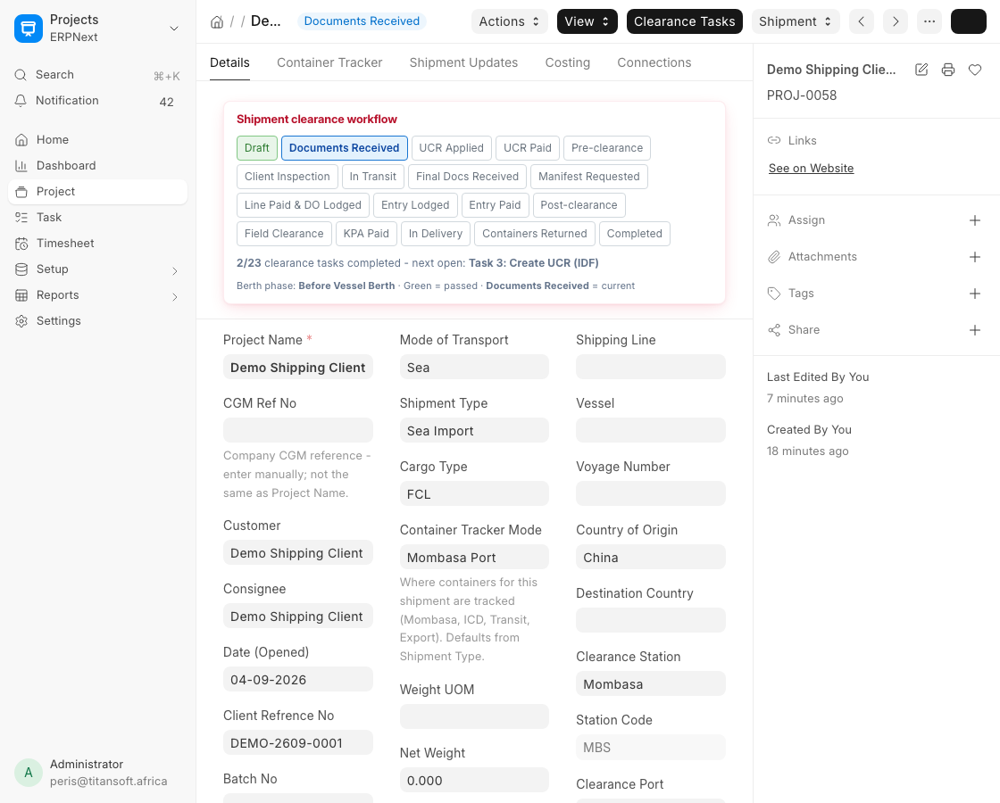
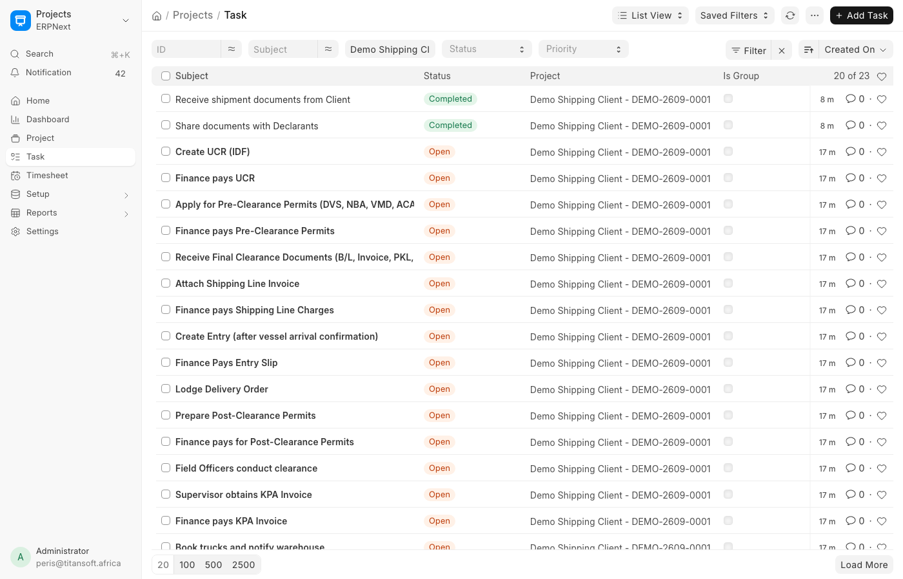

# Operations Guide

For **Operations**, **Documentation**, and **Field Operations** teams managing shipments day-to-day on Desk.

---

## Where to work

| Item | Path in Desk |
|------|----------------|
| Workspace | **CGM Shipping** |
| Shipment record | **Project** (filter by `custom_cgm_ref_no` or customer) |
| Tasks | **Task** (linked to Project; filtered by your department) |
| Live containers | **Container Ops Board** (page) |
| Daily reporting | **Daily Status Update** |

---

## How a shipment moves

A shipment lives as one **Project** from the moment sales hand it over until the containers are back. Four things happen, in this order:

1. **It is created.** Not by hand - an approved Opportunity is started as a shipment, which creates the Project with the cargo, parties and transport details already filled in. See the [CRM & Intake Guide](crm-intake.md).
2. **Its plan is written.** The task engine reads the Shipment Type and writes the whole clearance plan onto it at once (see [below](#where-the-tasks-come-from)).
3. **The plan is worked.** Each team completes its own tasks. As they close, the shipment status advances - but only as far as the completed tasks allow.
4. **It closes.** Every task complete, containers returned, status **Completed**.

The Project form shows all of this in one place. The stepper across the top is the clearance status, the line under it is progress against the plan and the next thing anyone is waiting on:

Read it as: **Documents Received** is where the shipment is now, **Draft** is behind it, *2/23 clearance tasks completed*, and the next thing needed is **Task 3: Create UCR (IDF)**. The tabs carry the rest - containers, the customer conversation, and costs.

---

## The clearance flow, end to end

The task plan below is the system's version of this. It helps to know the real-world sequence it is modelling, and which outside body you are waiting on at each point.

| # | Stage | Department | What happens |
|---|-------|------------|--------------|
| 1 | Transport document | Documentation | B/L or AWB captured with containers and goods description |
| 2 | Opportunity | Documentation | Commercial Invoice, Packing List, COA and the rest attached |
| 3 | Review | Operations Manager | Documents verified, then approved or returned for amendment |
| 4 | Project created | Operations | Approved shipment becomes a live Project with its task plan |
| 5 | Declaration | Declaration | UCR and IDF created, Finance pays the IDF |
| 6 | Pre-clearance permits | Declaration | **DVS**, **NBA**, **VMD**, **ACA**, **KEBS** as the cargo requires, plus client inspection |
| 7 | In transit | Tracking | Vessel or flight tracked, ETA updated, B/L, COC, COO, COA and marine insurance collected |
| 8 | Arrival and manifest | Declaration / Admin | Original B/L and manifest obtained, local import charges requested, Customs Entry created, e-slip and taxes generated, Finance pays |
| 9 | Customs and port clearance | Field Operations | **KRA** assigns a verification officer, **KPA** authorises positioning, **KEBS** and Port Health coordinated, joint verification, escalation to **CRO** if needed |
| 10 | Charges and release | Documentation / Finance | Delivery Order lodged with the shipping line, line charges and post-clearance permits paid, Supervisor obtains the KPA invoice, Finance pays it |
| 11 | Transport allocated | Transport | Transporter identified, truck and driver assigned, containers allocated, documents and ETA shared |
| 12 | Pickup and exit | Transport / Field Operations | Trucks enter the port, containers verified and loaded, gate pass issued |
| 13 | Delivery | Transport / Tracking | Truck movement monitored to warehouse or destination |
| 14 | Container return | Transport | Cargo offloaded, empty returned to depot, **interchange** issued |
| 15 | Closure | Finance / Documentation | Delivery confirmed, proof of delivery attached, final invoice sent |

**Transport is planned before the cargo is released** (stage 11 overlaps 9 and 10), so trucks move the moment clearance comes through rather than being arranged afterwards.

The interchange at stage 14 is what proves the container went back, and is what the **container deposit refund** is claimed against - see the [Transport & Containers Guide](transport-containers.md).

### Where you wait

Four points in the flow are waits on someone outside CGM, and they are the usual reason a shipment looks stalled:

- Vessel or flight arrival
- Final clearance documents from the client or origin agent
- The manifest from the shipping line
- KRA verification and the agencies' approvals

### Regional transit

A shipment moving beyond Kenya (Uganda, for example) adds exit notes, a **C2** cargo movement authorisation, and electronic cargo tracking devices on the truck.

---

## Your tasks in the sea-import plan (25 steps)

| Seq | Task | Your team |
|-----|------|-----------|
| 1 | Receive shipment documents from Client | Operations |
| 2 | Share documents with Declarants | Operations |
| 7 | Client conducts inspection | Operations |
| 8 | Receive Final Clearance Documents | Documentation |
| 9 | Request Manifest and Local Import Charges | Documentation |
| 12 | Attach Shipping Line Invoice | Documentation |
| 14 | Lodge Delivery Order | Operations |
| 17 | Field Officers conduct clearance | Field Operations |
| 18 | Supervisor obtains KPA Invoice | Operations |

Tasks **1–2** auto-complete when intake documents are verified on the Project.

!!! note "Finance-owned steps"
    Steps 4, 6, 11, 13, 16, 19 are Finance tasks. You attach invoices; Finance pays. See the [Finance Guide](finance.md).

!!! note "Declaration-owned steps"
    UCR, permits, and entry creation are Declaration tasks. See [Declaration & Customs Guide](declaration-customs.md).

!!! note "Transport-owned steps"
    Steps 20–25 are Transport. See [Transport & Containers Guide](transport-containers.md).

### Where the tasks come from

Nobody creates these by hand. The moment a Project is created, the task engine reads the **Shipment Type**, follows it to that type's **CGM Task Template**, and writes the whole plan onto the shipment at once - so a new shipment arrives with its tasks already in place and assigned to the right departments.

| Shipment Type | Template | Tasks created |
|---------------|----------|---------------|
| Sea Import | Sea Import Workflow | 23 |
| Air Import | Air Import Workflow | 16 |
| Sea Transit | Sea Transit Import Workflow | 15 |
| Road Transit Import | Road Transit Inbound Workflow | 11 |

**A Project saved without a Shipment Type gets no tasks at all**, silently - there is nothing in the form to tell you. The same is true of a type with no template behind it (**Import** and **Sea FCL** currently have none). If a shipment has an empty task list, that is the first thing to check.

The whole plan lands on the shipment at once, in sequence, with the first steps already closed where intake documents were verified:

Because the plan is written at creation, editing a template changes shipments created **after** the edit. It does not rewrite shipments already running - those keep the plan they were opened with, and setting the Shipment Type later does not backfill them.

---

## Project workflow (shipment status)

The Project field **`custom_shipment_status`** tracks clearance progress (`CGM Sea Import Workflow`):

Each move is an action on the form, in this order:

| From | Action | To |
|------|--------|-----|
| Draft | Receive Client Documents | Documents Received |
| Documents Received | Create UCR Application | UCR Applied |
| UCR Applied | Confirm UCR Paid | UCR Paid |
| UCR Paid | Start Pre-clearance Permits | Pre-clearance |
| Pre-clearance | Request Client Inspection | Client Inspection |
| Client Inspection | Start Shipment Tracking | In Transit |
| In Transit | Receive Final Documents | Final Docs Received |
| Final Docs Received | Request Manifest and Charges | Manifest Requested |
| Manifest Requested | Lodge Customs Entry | Entry Lodged |
| Entry Lodged | Confirm Line Paid and DO Lodged | Line Paid & DO Lodged |
| Line Paid & DO Lodged | Confirm Entry Paid | Entry Paid |
| Entry Paid | Complete Post-clearance Permits | Post-clearance |
| Post-clearance | Hand to Field Officers | Field Clearance |
| Field Clearance | Confirm KPA Paid | KPA Paid |
| KPA Paid | Dispatch Cargo | In Delivery |
| In Delivery | Confirm Containers Returned | Containers Returned |
| Containers Returned | Complete Shipment File | Completed |

Note the order around the entry: **Line Paid & DO Lodged sits between Entry Lodged and Entry Paid**. The delivery order is lodged with the shipping line once the entry is in, and the entry is confirmed paid after that - not the other way round.

### What blocks you from advancing status

| Rule | Meaning |
|------|---------|
| **Task gates** | You cannot skip ahead of incomplete tasks (configured in CGM Shipping Settings) |
| **Document gates** | Required documents must be **Verified** before some state changes |
| **Intake documents** | **CI** and **PKL** required before **Documents Received** |
| **Closure** | All 25 sea tasks must be complete before **Completed** |

---

## Being told it is your turn

You do not have to watch the shipment. When a task becomes your department's to do, a **Your Turn** notification goes out:

| Notification | Reaches |
|--------------|---------|
| `CGM Task - Your Turn Operations` | CGM Documentation, Operations Manager |
| `CGM Task - Your Turn Documentation` | CGM Documentation |
| `CGM Task - Your Turn Declaration` | Declarant |
| `CGM Task - Your Turn Finance` | Accounts User, Accounts Manager, Finance User |
| `CGM Task - Your Turn Transport` | Transporter |

The subject carries the task and the shipment, so it is clear what is being asked and against which job.

These are ordinary ERPNext Notifications. **CGM Shipping Settings** maps each workflow event to the Notification it should send, so wording and recipients can be changed in the Desk without touching code - migrate only seeds defaults that are missing, and never overwrites edits. Finance has a further set for invoices and receipts; see the [Finance Guide](finance.md).

---

## Documents on Project

Open the Project → **Shipment Documents** child table.

| Action | When |
|--------|------|
| Upload initial version | Client sends draft document |
| Upload final version | Corrected / stamped version received |
| Verify / Reject | Supervisor confirms document is acceptable |

Document types are masters in **Document Type** (codes like `CI`, `PKL`, `MANIFEST`, `DO`, etc.).

---

## Container Ops Board

Route: **CGM Shipping → Container Ops Board** or `/app/container-ops-board`

Use this page to:

- See overdue empty returns and demurrage risk
- Filter by client, project, B/L, batch, clearance station
- Track containers through lifecycle statuses
- Monitor **Empty Return Tracker** tab

Container statuses: Pending Arrival → Vessel Berthed → Discharged / At Port → Released / In Transit → At Warehouse → Cargo Offloaded → Empty Returned → Interchange Received.

---

## Daily Status Update

Submit a **Daily Status Update** (`DSU-{date}-{#####}`) for RAG reporting on active shipments. Finance and management receive notifications when configured.

---

## Common workflow

### New shipment (after CRM)

1. Confirm Project exists from approved Opportunity.
2. Verify **CI** and **PKL** on Project documents.
3. Advance status to **Documents Received** when intake is complete.
4. Complete task 1–2 (often automatic).
5. Hand off to Declaration for UCR (task 3).

### After vessel arrival

1. Confirm ATA on Project (Actions → Confirm Shipment Arrival at the Port) to create Container Trackers.
2. Create Entry (Declaration, task 12) proceeds independently for Entry Slip / ENTRY paperwork.
3. After finance pays entry (task 13), continue shipping-line / DO steps as sequenced.
4. Lodge DO when line charges are paid.

### Field clearance

Tasks 17-19 in the plan. On the ground at the terminal it runs like this:

1. **Receive the file.** Commercial Invoice, Packing List, Bill of Lading, Customs Entry and any permits come from the declarant or admin.
2. **Open the shipment file** and record the details for tracking.
3. **Request verification from KRA.** Once the containers are in the yard, email KRA Customs with the entry to declare the intention to verify, so they can assess risk and allocate an officer.
4. **KRA issues instructions.** Depending on the goods and how they are packed, they order **partial verification**, **100% verification** or **scanning**, and tell KPA by official memo.
5. **KPA authorises positioning.** KPA reviews KRA's memo and issues its own, allowing the container to be positioned.
6. **Call the other agencies.** Notify whoever else is involved - **KEBS**, **KRPB**, **Port Health** - to attend the joint verification.
7. **Joint verification.** The agencies and KRA verify together. Each releases its own permit once satisfied.
8. **KRA examination account**, once every other agency has released its part.
9. **Escalate to the CRO** for final release of the entry.
10. **Initiate the pick-up order.** Always done from Nairobi.
11. **Pay the KPA invoice** for port charges (task 18 → Finance, task 19) and confirm payment with KPA.
12. **Book trucks** to collect the cargo - Transport takes over for tasks 20-25.

Steps 3 to 9 are the part that takes unpredictable time: everything there waits on KRA, KPA or an agency.

---

## Tips & guards

- You only see **Tasks** for your **department** (permission-scoped).
- Do not manually edit **Finance Cost Total** on Project - it is system-calculated.
- One **Project** per **Opportunity**; use `custom_source_opportunity` to trace origin.
- B/L container rows sync to **Container Tracker** records on the Project.

---

## Related guides

- [Declaration & Customs](declaration-customs.md)
- [Finance](finance.md)
- [Transport & Containers](transport-containers.md)
- [CRM & Intake](crm-intake.md)
