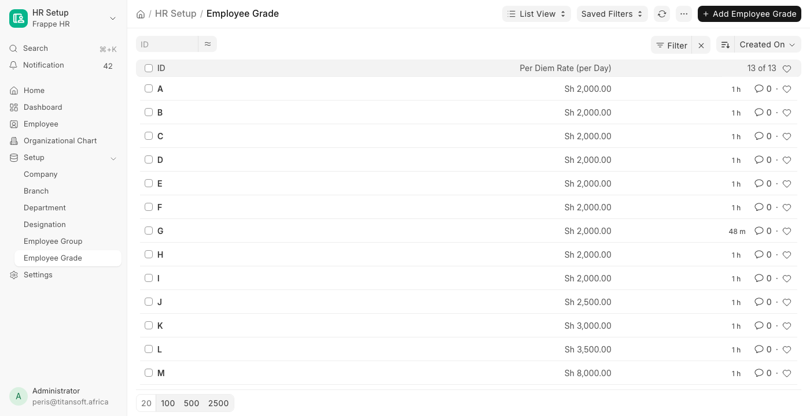
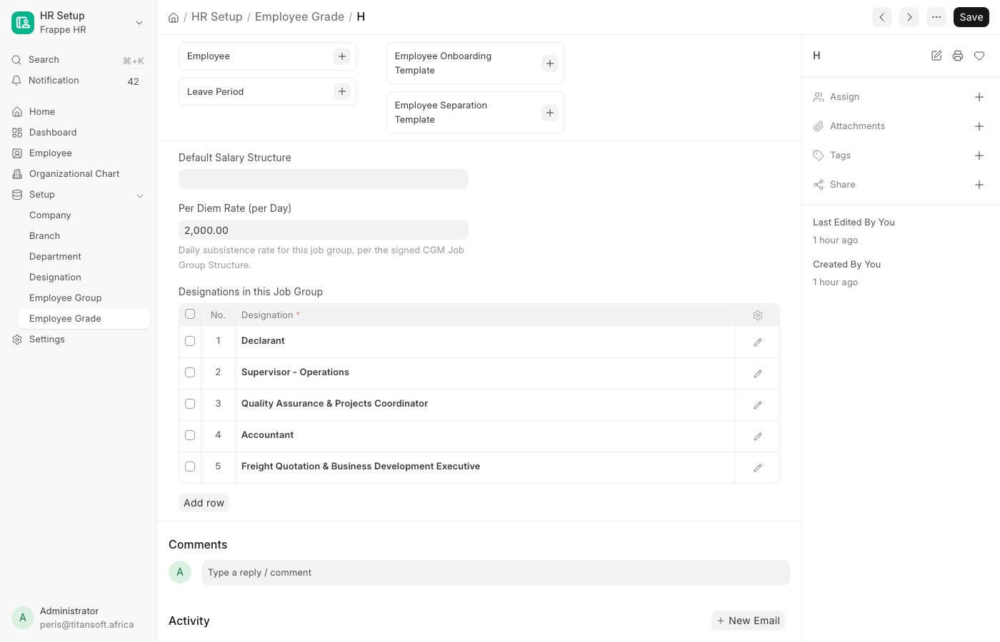
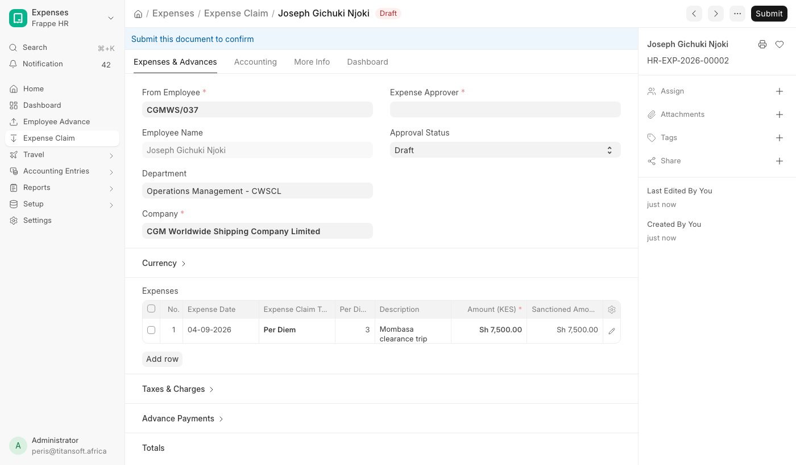

# Job Groups & Per Diems

For **HR** (who own the rates) and **every employee** (who claim against them).

Source document: **CGM Job Group Structure & Per Diem Rates** - the signed HR structure that grades every post from **M** down to **A** and sets a daily subsistence rate per group.

---

## Where the rates live

Rates are held on **Employee Grade**, one record per job group letter - not on the employee record.

That is deliberate. Employee Grade can only be opened by **HR Manager**, **HR User** and **System Manager**, so the rate table stays with HR. An employee never sees anyone's rate but their own, and only as the amount on their own claim.

| Where | What you see |
|-------|--------------|
| **Employee Grade** (`/app/employee-grade`) | Every job group with its rate, straight off the list. Open one for the designations that sit in it |
| **Employee** → Grade | Which job group a person sits in. No rate is shown here |

Every job group and its rate, read straight off the Employee Grade list:

> If a non-HR role is ever granted read on Employee Grade, the next `bench migrate` writes a **CGM per diem rates readable outside HR** entry to the Error Log. The app does not change those permissions itself - it only tells you they drifted.

---

## The structure

| Job group | Per diem / day (KES) | Posts |
|-----------|---------------------|-------|
| **M** | 8,000 | Chairman, Director |
| **L** | 3,500 | Group HR & Admin Manager, Group Chief Finance Officer, Group Sales & Marketing Officer, Group Operations Manager |
| **K** | 3,000 | Assistant Group Finance Manager, Assistant Group Sales & Marketing Manager |
| **J** | 2,500 | Operations Manager |
| **I** | 2,000 | Senior Supervisor |
| **H** | 2,000 | Declarants, Senior Operations Supervisor, Quality Assurance & Project Co-Ordinator, Accountant, Freight Quotation & Business Development Executive |
| **G** | 2,000 | IT Executive, Digital Marketing Executive, Accounts Assistant, Office Admin Executive, Operations Admin Executive |
| **F** | 2,000 | Operations Supervisor, Operations Officer - Tracking & Transport |
| **E** | 2,000 | Field Operations Officer |
| **D** | 2,000 | Assistant Field Operations Officer |
| **C** | 2,000 | Office Assistant |
| **B** | 2,000 | Interns |
| **A** | 2,000 | Unclassified (Casuals, Attachés) |

Groups **E** through **A** share one rate band in the signed document, so interns and unclassified staff carry the same 2,000 as field operations officers.

Where the structure's wording differs from the **Designation** master, the post links to the designation people actually hold - e.g. *IT Executive* in the document is the *ICT Executive* designation.

Opening a job group shows its rate and the designations that sit in it:

---

## Claiming a per diem

1. Open **Expense Claim** → **Add Expense Claim** (`/app/expense-claim/new`).
2. In **Expenses**, add a row and set **Expense Type** to **Per Diem**.
3. Enter **Per Diem Days** - the number of days away.
4. **Per Diem Rate** and **Amount** fill in themselves from your job group. Both are derived; typing over the amount will not hold.
5. Add any other expenses (Travel, Food, …) as separate rows in the normal way.
6. **Save** and submit to your expense approver.

The rate is applied again on the server when you save, so a claim can never be filed at a rate your job group does not give you.

Three days at job group **J** (2,500 a day), priced automatically:

### What an approver can change

| Change | Allowed |
|--------|---------|
| **Sanction less** than claimed, to part-approve a trip | Yes. The lower figure stands |
| **Sanction more** than the days and rate give | No. It is capped back to the derived amount on save |
| **Change the days** | Yes, and the amount reprices from them |
| **Type a different amount or rate** | No. Both are derived and overwritten on save |

### Advancing a per diem before the trip

On **Employee Advance**, set **Per Diem Days** and the **Advance Amount** is priced the same way. Leave the field blank for advances that are not per diems - the rest of the form behaves exactly as before.

---

## What HR has to do

| Situation | Action |
|-----------|--------|
| **A rate changes** | Edit **Per Diem Rate (per Day)** on that Employee Grade. Nothing overwrites it - the seed only fills blanks |
| **A new employee** | Set **Grade** on their Employee record. Without a grade they cannot claim a per diem, and the error says so |
| **A new post** | Add its designation to the **Designations in this Job Group** table on the right grade |
| **A post moves group** | Remove it from the old grade first - a designation can sit in only one job group (see below) |
| **Before the first claim** | Finance must complete two account settings - see below |

### Finance setup before the first claim

Two accounts have to be set, or per diem claims stop part-way. Neither is specific to per diems, but neither was configured when the feature went in:

| Setting | Where | What happens without it |
|---------|-------|-------------------------|
| Account for the **Per Diem** claim type | **Expense Claim Type** → Per Diem → Accounts | The claim will not **save**: *Set the default account for the Expense Claim Type Per Diem* |
| **Default Expense Claim Payable Account** | **Company** → HR & Payroll | The claim saves but will not **submit**: *Account is required* |

The second one catches people out, because a claim can be raised and approved before anyone discovers it cannot be posted.

### One designation, one job group

A designation can appear in **only one** job group. Adding it to a second is refused on save, naming the grade that already holds it:

> A designation can sit in only one job group. Remove it from the other grade first:
> *Operations Manager* is already in job group **J**

The reason is that a post in two groups would carry two per diem rates, and nothing could say which applies - an employee's rate would come down to whichever grade someone happened to set. Listing the same designation twice inside one grade is refused for the same reason.

To move a post between groups, remove it from the old grade, save, then add it to the new one.

---

### Employees the structure does not place

The migrate that applied the structure graded everyone it could name, then listed the rest. Anyone whose post is not in the signed document - Renka, IRL and Elgon staff, warehouse and sales roles - is left **without a grade** for HR to place by hand. They cannot claim a per diem until then.

---

## When something is refused

Every message below is the system working as intended, not a fault:

| Message | What it means | Fix |
|---------|---------------|-----|
| *&lt;name&gt; has no job group. Ask HR to set the Grade on the employee record.* | The claimant has no **Grade**, so there is no rate to price from | HR sets Grade on the Employee record |
| *Job group X has no per diem rate.* | The grade exists but its rate is blank | HR sets **Per Diem Rate (per Day)** on that Employee Grade |
| *Row #N: enter the number of days claimed for Per Diem.* | A Per Diem row was left with no days | Enter the days, or change the expense type |
| *Set the default account for the Expense Claim Type Per Diem* | Finance has not mapped an account to the claim type | See **Finance setup** above |
| *Account is required* (on submit) | No **Default Expense Claim Payable Account** on the Company | See **Finance setup** above |
| *A designation can sit in only one job group.* | The post is already in another grade | Remove it there first, then add it here |

---

## How it was applied

- The A–M grades, their rates, and the **Per Diem** claim type are seeded by `install.after_migrate`, so a fresh site gets them too.
- `backfill_employee_job_groups` graded active employees: by **office holder name** first (the people named in the document), then by **designation**. It only ever fills a blank grade, so anything HR sets or corrects afterwards stands.
- The designation match reads the **live** Employee Grade tables, not the original document. Add a designation to a grade and re-running the assignment will place the people holding it.
- Employees the document does not cover, and office holders with no Employee record, are printed in the migrate output rather than guessed at.

Code: [`customizations/per_diem.py`](../../cgm_shipping/cgm_worldwide_shipping/customizations/per_diem.py)
