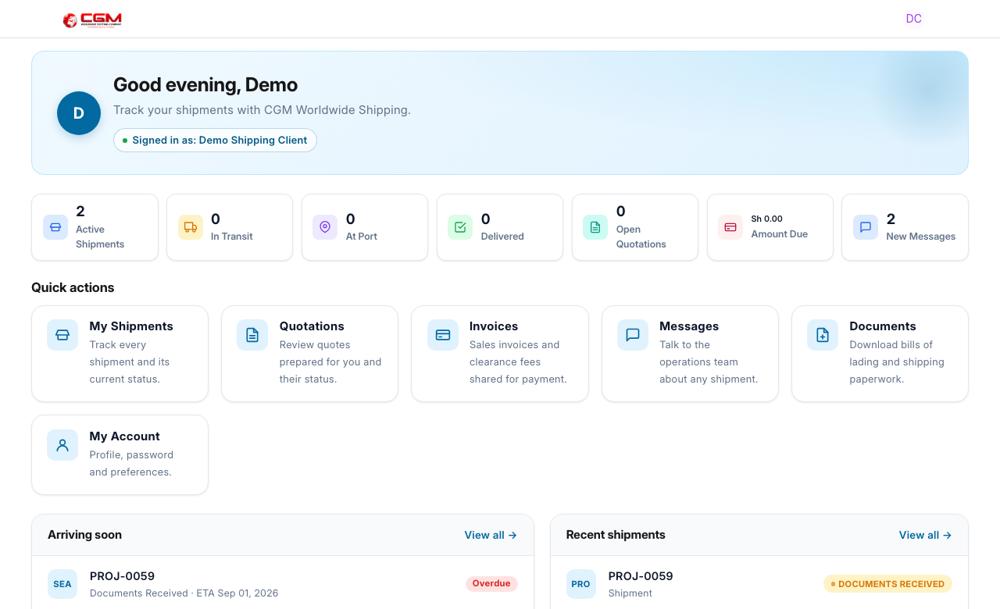
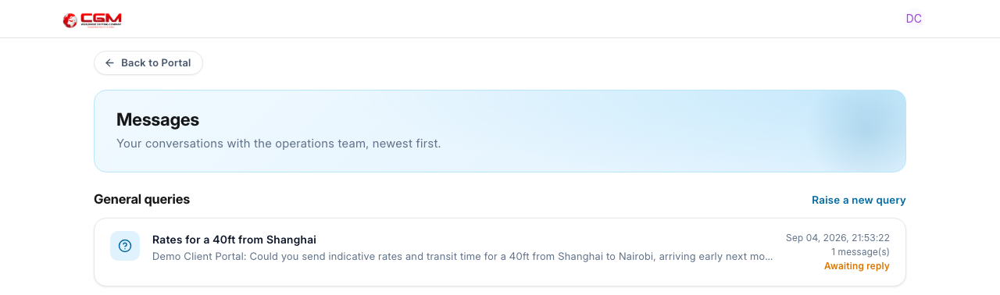
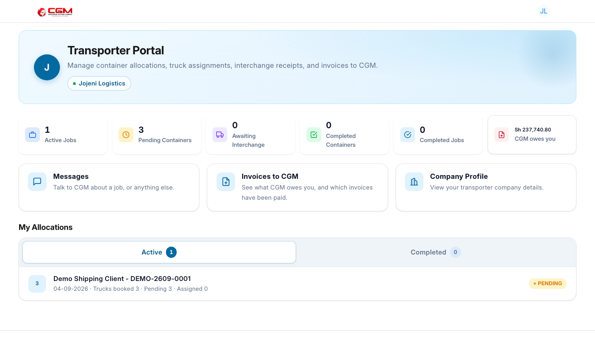

# Customer & Transporter Portal Guide

For **portal users** and **support staff** helping customers and transporters use the website.

---

## Customer portal

**Role:** `Customer` (Website User linked to Customer master)  
**Home after login:** `/portal`

| Route | Purpose |
|-------|---------|
| `/portal` | Dashboard home |
| `/my-shipments` | List of customer shipments |
| `/shipment` | Shipment detail / progress |
| `/documents` | Download uploaded documents |
| `/my-quotations` | View quotations shared with client |
| `/my-invoices` | View sales invoices |
| `/my-messages` | Conversations with operations |

The dashboard customers land on after login, with shipment counts and the quick actions for each area:

### What customers see

- Shipment progress aligned with Project workflow status
- Document availability (as shared by operations)
- Commercial documents when quotation is **Shared with Client**
- Timestamps localized to browser timezone (`portal_localize_time.js`)

### Fees to pay

When Finance shares a clearance fee for the client to settle, it appears on `/my-invoices` under **Clearance fees to pay**, and on the shipment page under **Fees to pay**. Each row shows what the fee is, its amount, and where it stands.

What the client does:

1. **Download** the invoice.
2. Pay it, then press **I have paid**. The row changes to **Payment reported**.
3. Attach the proof: **Attach POP** for shipping line charges, **Attach Receipt** for everything else. PDF, JPG or PNG, up to 15 MB.

The row then reads **POP sent** or **Receipt sent**, and the file lands on the finance task for Finance to verify. Until the client attaches something, the row nudges them to do so.

Only invoices Finance has verified and shared appear here, and only for that customer's own shipments. See [Finance](finance.md).

### Feedback and ratings

Both portals have a **Feedback** tab - customers on the shipment page, transporters on the allocation page.

- A **rating** out of 5 stars, in half stars, is required.
- **What is this about?** picks a category: Overall Service, Communication, Timeliness, Documentation, Container Handling, Transport & Delivery or Other.
- **Containers this is about** lets them point at specific boxes. Leaving them unticked means the whole shipment.
- There is a comments box and an **I would recommend CGM Worldwide Shipping** tick.

One entry per party per shipment: submitting again updates their earlier rating, and they are told when they last rated it.

Each submission creates a **Portal Feedback** record and notifies Operations. Staff open it in the desk to read the rating, category, containers and comments, set **Status** to Acknowledged or Resolved, and write a **Response**. The party sees that reply on the same tab, under **CGM replied**.

### Desk vs portal

| Action | Where |
|--------|-------|
| Upload clearance documents | Desk (operations) |
| View progress | Portal |
| Approve quotation internally | Desk (finance) |
| View shared quotation PDF | Portal |

---

## Messages

Both portals carry a two-way conversation with operations. The thread is the record, kept against the shipment rather than in anyone's inbox - and the portal user is emailed when operations reply, so they do not have to keep checking.

**For the customer** (`/my-messages`, and the **New Messages** tile on the dashboard):

- One row per shipment that has messages: the newest message, who sent it, and how many CGM messages are still unread. Opening a row goes to that shipment's **Messages** tab.
- **General queries** for anything not tied to a shipment. Each is its own thread.

**For the transporter**, the **Messages** card on the dashboard: questions about a job, or anything else.

### Posting an update to a portal

Operations publish updates from three places, all opening the same **Post update to portal** dialog:

- the **Container Tracker** form, under **Portal**;
- the **Container Ops Board**, on the **Updates** tab;
- the **Project**, on the **Shipment Updates** tab.

The dialog asks for the shipment, an optional container, a subject and the message, and lets you tick who should see it - the customer, the transporter, or both. Nothing is published to a party until one of those ticks is set.

Portal accounts cannot post updates from the desk, whatever roles they hold.

### How operations sees them

Messages are **Shipment Update** records (`MSG.YY.#####`), so a conversation is threaded, searchable and attached to the shipment rather than living in someone's inbox. Each carries its source - Customer, Transporter or Internal - a link to the shipment, customer, container or allocation, and an optional attachment.

| Field | What it does |
|-------|--------------|
| **Customer Portal** / **Supplier Portal** | Whether the message is visible in that portal |
| **In Reply To** | Threads a reply onto the message it answers |
| **Response Status** | **Open**, **Answered** or **Closed**, with who answered and when |
| **Read by Customer On** / **Read by Transporter On** | Set when the other side opens the thread - this is what drives the unread counts |

### The rule that catches people out

**A message written by CGM stays internal unless it is explicitly published to a portal.** A party's own message is always visible to that party, so a customer's question reaches operations by default - but an internal note written against the shipment does *not* reach the customer until the visibility flag is set.

That is deliberate: it lets operations keep working notes on a shipment without the customer reading them. It also means a reply the customer never sees looks, from the desk, exactly like one they did. If a customer says they had no answer, check the **Customer Portal** flag on the reply before anything else.

---

## Transporter portal

**Role:** `Transporter`  
**Home after login:** `/transporter`

| Route | Purpose |
|-------|---------|
| `/transporter` | Transporter dashboard |
| `/transporter/allocation` | Container allocation jobs |
| `/transporter/profile` | Profile settings |

The dashboard: job and container counts, what CGM owes, and the allocations awaiting trucks.

Transporter users are synced from **Supplier** records marked as transporters (`transporter_supplier.py`).

---

## Supporting portal users

### Customer cannot see shipment

1. Confirm Website User is linked to correct **Customer**.
2. Confirm Project customer matches.
3. Check document sharing / project visibility rules in portal API (`portal.py`).

### Transporter cannot see allocation

1. Confirm Supplier has transporter flag and portal user linked.
2. Confirm **Container Allocation** is submitted.
3. Check allocation references correct Project/B/L.

### Customer says they never got a reply

1. Open the reply on the shipment's **Messages** tab and check **Customer Portal** is ticked. A CGM message stays internal until it is.
2. Check the reply is threaded onto their question (**In Reply To**), not posted as a loose note.
3. **Read by Customer On** tells you whether they have opened the thread since.

---

## Related guides

- [CRM & Intake](crm-intake.md)
- [Transport & Containers](transport-containers.md)
- [Commercial](commercial.md)
