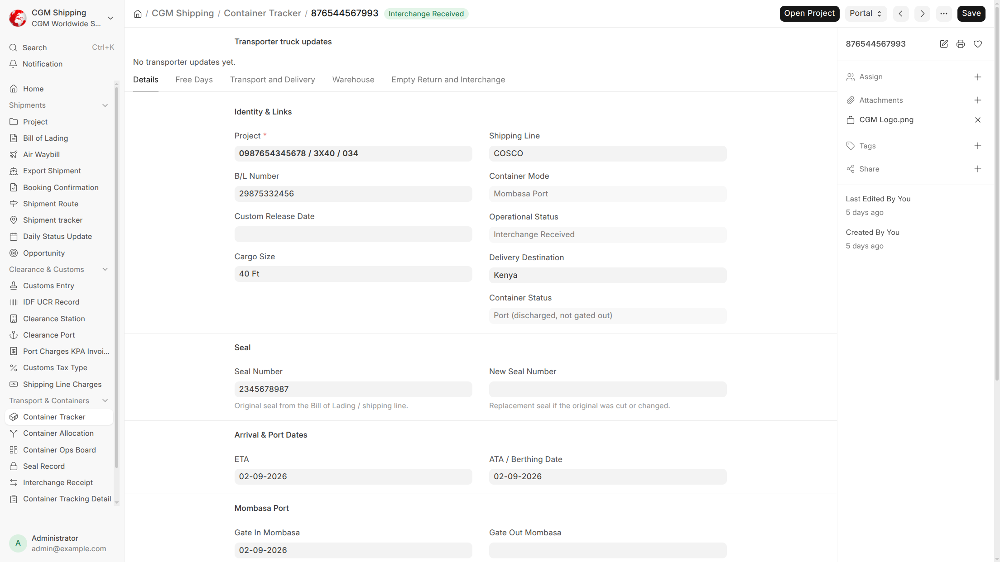
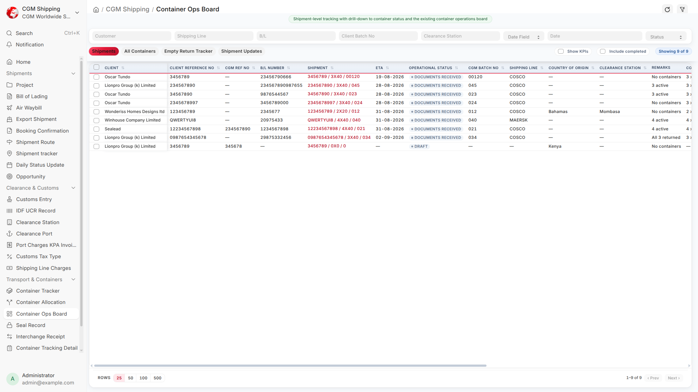

# Transport & Containers

**Container Tracker, Ops Board, transporter allocations, and delivery / empty-return tasks.**

Use this guide for sea-import transport execution and container charging. Other Shipment Types have fewer or different transport steps — same tools, different sequences.

A typical scenario: After KPA is paid, you book trucks (task 20), gate out (21), monitor delivery (22), offload (23), return empties (24), and file interchange (25), updating each Container Tracker from the Task.

To access Transport work, go to:

> Home > CGM Shipping > Container Tracker

Also use:

> Home > CGM Shipping > Container Ops Board

> Home > CGM Shipping > Container Allocation





## 1. Prerequisites

- Transport / Operations roles
- Bill of Lading (or mode equivalent) with container rows where FCL
- Project with Container Tracker Mode from Shipment Type
- Shipping line free days / demurrage configured on Supplier when charging applies

:::tip
Sea Import transport tasks are **20–25** below. Export and transit templates use different seqs (for example book trucks earlier on transit). See [Shipment Modes](shipment-modes.md).
:::

## 2. Features — Container lifecycle

```
Bill of Lading containers
  → Container Tracker (one per container_number per project)
    → Task Container Updates (transport tasks)
      → Daily metrics refresh (demurrage / detention)
        → Container Ops Board
```

| Status | Typical trigger |
|--------|-----------------|
| Pending Arrival | Created, vessel not yet berthed |
| Vessel Berthed | ATA / berth date set |
| Discharged / At Port | Discharge date |
| Released / In Transit | Gate out from port |
| At Warehouse | Arrival at CFS / warehouse |
| Cargo Offloaded | Offload confirmed |
| Empty Returned | Empty at depot |
| Interchange Received | Interchange receipt filed |
| Return Overdue | Past free days / deadline |

Statuses are **derived from dates** (daily scheduler).

## 3. How to — Sea Import transport tasks (20–25)

| Seq | Task |
|----:|------|
| 20 | Book trucks and notify warehouse |
| 21 | Load trucks and exit port |
| 22 | Monitor delivery to destination |
| 23 | Offload cargo |
| 24 | Return empty container to depot |
| 25 | Receive interchange confirmation |

Use **Task Container Update** on these tasks for per-container dates.

## 4. Features — Ops Board and Allocation

**Container Ops Board** (`container-ops-board`): KPI tiles, filters, All Containers / Empty Return Tracker.

**Container Allocation**: assign containers to a transporter **Supplier**; transporters see jobs at `/transporter/allocation`. See [Portals](portals.md).

## 5. Features — Charges, interchange, reports

On **Supplier** (shipping line): Free Days Rule, Demurrage Tier, Detention Tier.

**Interchange Receipt** confirms empty return (task 25 on Sea Import).

| Report | Use |
|--------|-----|
| Container Tracking Detail | Full timeline |
| Container Return Tracker | Empty return focus |
| Container Tracking Report | Summary |

:::note
Finance shipping-line payment on Sea Import is tasks **10–11**, not 12–13. See [Finance](finance.md).
:::

## 6. Related Topics

- [Shipment Modes](shipment-modes.md)
- [Operations](operations.md)
- [Portals](portals.md)
- [Finance](finance.md)
